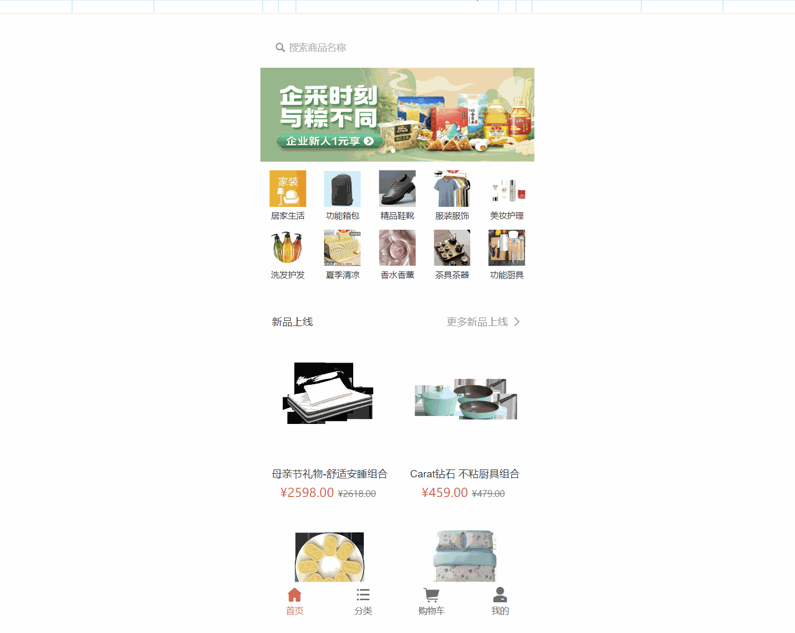
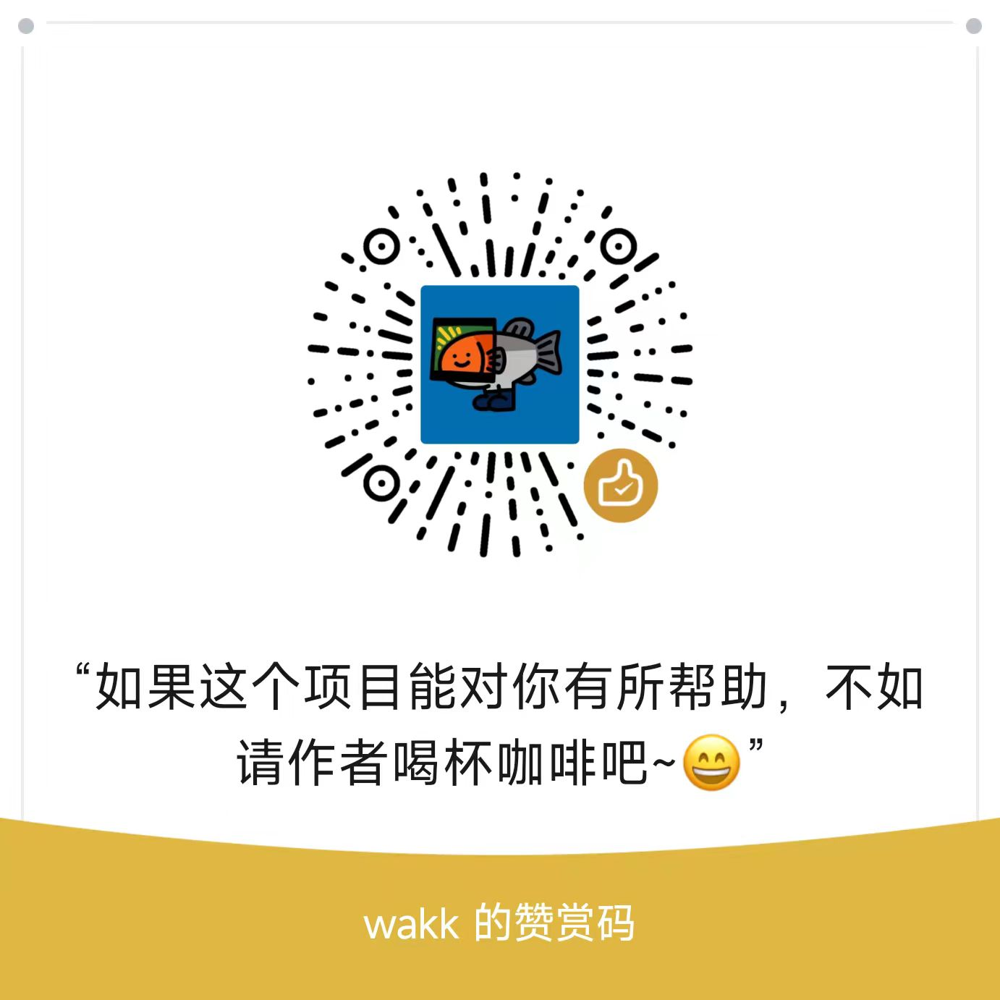

## yuexboot-mall项目

yuexboot-mall是一套全部开源的微商城项目，包含一个运营后台、h5商城和后台接口。
实现了一个商城所需的首页展示、商品分类、商品详情、sku详情、商品搜索、加入购物车、结算下单、订单状态流转、商品评论等一系列功能。
技术上基于Springboot2.0，整合了Redis、RabbitMQ、ElasticSearch等常用中间件，
贴近生产环境实际经验开发而来不断完善、优化、改进中。

- [h5商城项目](https://github.com/yuex111/yuexboot-mobile)
- [运营后台项目](https://github.com/yuex111/yuexboot-admin)  
- [后台接口项目](https://github.com/yuex111/yuexboot-mall)  

## yuexboot-mobile

* 基于vue2 + VantUI开发的h5商城
* 提供一般商城项目所需要的基本功能
* `vw` 移动端适配，`css` 预处理器，浏览器默认样式处理
* axios响应拦截，统一异常处理
* 支持`svg-icon` 图标组件

> 如果有任何使用问题，欢迎提交Issue或加wx告知，方便互相交流反馈～ 💘。最后，喜欢的话麻烦给我个star

关注我的公众号：程序员yuex，专注技术干货输出、分享开源项目。回复关键字：

- **加群**：加群交流，探讨技术问题。
- **演示账号**：获得 yuexboot-mall 商城后台演示账号。
- **开源项目**：获取我写的三个开源项目，包含PC、H5商城、后台权限管理系统等。
- **yuex商城资料**：获取wayhboot-mall项目配套资料以及商城图片压缩包下载地址。
- **加微信**：联系我。


---

## 文件目录
```javascript
|-- public                // public
|-- config                // config配置文件
|-- src
|   |-- api               // 接口列表
|   |-- assets            // 图片资源
|   |-- components        // 公共组件
|   |-- filter            // 全局过滤器
|   |-- icons             // svg图标
|   |-- router            // 路由
|   |-- store             // vuex
|   |-- styles            // 公共样式
|   |-- types             // 文件声明
|   |-- utils             // 工具函数
|   |-- views             // 商城各级页面
|   |   |-- ....          // ...
|   |-- App.vue           // 主页面
|   |-- main.js           // 入口文件
|   |-- permission.js     // 权限控制文件
|-- .eslintrc.js          // eslint配置
|-- babel.config.js       // babel配置文件
|-- jsconfig.config.js    // vscode配置文件
|-- env.development       // 开发环境配置
|-- env.production        // 生产环境配置
|-- jsconfig.config.js    // vscode配置文件
|-- package.json          // 客户端依赖
|-- postcss.config.js     // postcss配置文件
|-- vue.config.js         // vue相关配置文件
|-- ...
```

## 本地开发
```
# 前置准备
下载 nodejs v16.20.1 版本

# 克隆项目
git clone git@github.com:yuex111/yuexboot-mobile.git

# 进入项目目录
cd yuexboot-mobile

// 清空缓存
npm cache clean --force

// 切换新淘宝源
npm config set registry https://registry.npmmirror.com

# 安装依赖
npm install

# 启动服务
npm run dev
```

## 在线体验

演示地址以及账号：关注我的公众号【程序员yuex】，发送 演示账号

## 演示gif



## yuexboot-mall交流群

关注我的公众号【程序员yuex】，发送 加群，拉你进我的技术交流群

## 感谢

- [panda-mall](https://github.com/Ewall1106/vue-h5-template)
- [litemall](https://github.com/linlinjava/litemall)
- [vant-ui](https://github.com/youzan/vant)

# 捐助


